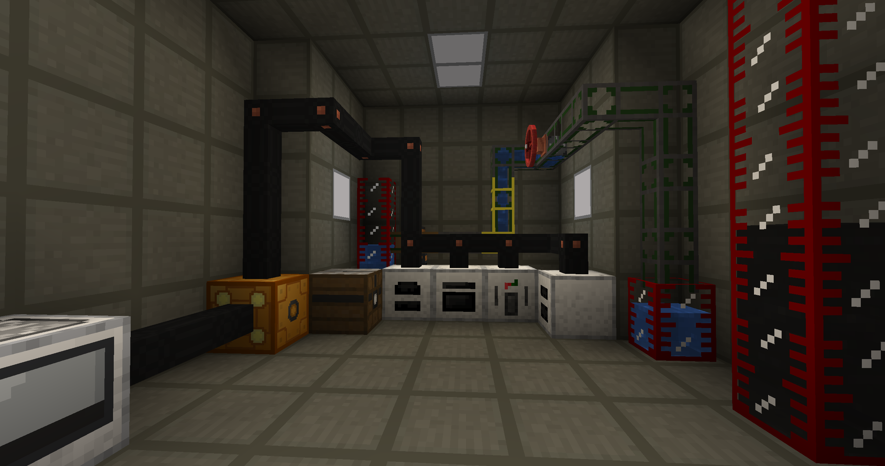

# Faktocraft

Faktocraft is a modern successor of several classic tech mods - **IndustrialCraft 2**, **BuildCraft** and **Logistics Pipes** - brought together into a single mod: electrical machines, tiered power grids, item and fluid pipes, automated mining and a request-based logistics system.

> ℹ️ The mod is in **beta**. The feature set is complete and every system has been played through, but balance is still being tuned and bugs may remain.

## Features

### Power
- Five voltage tiers (Low to Ultra) with their own cables, transformers, circuit breakers and battery boxes. Feeding a machine the wrong tier makes it explode; bare cables shock whoever touches them.
- Generators for every stage: fuel burners, geothermal, combustion, five solar panels and a wind generator driven by a live wind simulation.
- A 3x3x3 **Nuclear Reactor** with a real heat model: rods and reflectors heat it, water and coolant kits cool it, and it melts down if you let it.
- Charge pads, capacitors and machine upgrades (overclocker, efficiency, tension).

### Machines
- Ore processing chain: crusher, ore washing plant and thermal centrifuge for extra output.
- Manufacturing: compressor, metal former, extruder, circuit assembler, sawmill, three alloy smelters (coal, combustion, electric), canning machine and more.
- Endgame: recycler, matter fabricator, scanner and replicator.

### Oil and chemistry
- Oil pockets, giant underground reservoirs and surface lakes in dry biomes.
- Fluid pump, tanks, fluid pipes with valves, and the Ender Tank that shares its contents across any distance or dimension.
- Fuel Distillery, Polymerizer (plastic and rubber), Fluid Enricher (sulfuric acid, coolant) and Fermenter (biofuel).

### Logistics
- Transparent item pipes: you can watch items travel.
- Chassis pipes with modules (sink, provider, extractor, supplier, collector, ejector, disposal) and a RimWorld-style item filter.
- Logistics Core and Request Table: ask for an item and the network gathers it or crafts it through craft pipes, recipe pipes and the assembly table, splitting work across machines.

### World and mining
- Rubber trees, seven new ores and uranium.
- Geological Prospector and Geological Scanner with shared scan channels.
- BuildCraft-style Quarry with landmarks, and a Forester that plants, fertilizes and harvests trees.
- Hole Drill: bore through walls and hide cables and pipes inside the blocks.

### Radiation
- Uranium items, the reactor, meltdowns and the Nuke irradiate their surroundings. Lead and reinforced stone shield it.
- Geiger Counter and a four-piece Hazmat suit.

### Gear and utility
- Jetpacks, nano and quantum armor, electric tools, night vision goggles.
- Status Monitor wall panel that shows live information about any block, Teleport Anchors (including a dimensional one), Chunk Loader, Luminator, reinforced stone and glass.

## Requirements

- **Minecraft 26.3 with NeoForge** (26.3.0 beta or newer) - the `26.3` branch. The 1.20.1 Forge version lives on the `main` branch and keeps receiving fixes only.
- Java 25 (bundled with the launcher).

## Compatibility

Faktocraft has a single mixin (it redirects the GUI renderer target while the Status Monitor draws its off-screen panel) and no coremods or access transformers, so it rarely conflicts with other mods.

### Compatible

- **JEI** - recipe categories for every machine, recipe transfer (the `+` button) into machines, the request table and the craft/recipe pipes.
- **Jade** - energy, cable, circuit breaker, valve, reactor and machine info in the overlay. When Jade is on both the server and the client, the Status Monitor shows Jade's own tooltip for the watched block.
- **Sodium** and **Distant Horizons**.
- **REI** - the plugin is kept in the source tree but is not built until REI ships a NeoForge 26.3 release.

### Compatible without integration

- Minimaps, inventory tweaks, UI mods and most performance mods.
- **Any mod using NeoForge item and fluid capabilities** (the transfer API) - inventories, tanks, buckets and hoppers work with the pipes, the quarry and the machines. Storage networks such as Applied Energistics 2 and Refined Storage are reachable as ordinary inventories.
- **Common tags** - ores, ingots, dusts and other materials use the `c:` tags, so shared ores and ingredients from other mods are recognized. The quarry mines any ordinary block from any mod and can be tuned with the `faktocraft:quarry_blacklist` and `faktocraft:quarry_mineable` block tags; radiation shielding uses the `faktocraft:radiation_shielding` tag.
- **Datapacks, KubeJS, CraftTweaker** - every recipe type has a JSON serializer, so Faktocraft recipes can be added, changed or removed. Oil generation is plain worldgen JSON.
- **FE mods** (Mekanism, Thermal, Powah, Create and others) - Faktocraft power is its own system and is not exposed as FE. There is no converter yet.
- **Curios** - the jetpack and the night vision goggles must be worn in the armor slots.
- **Land claim mods** (FTB Chunks, Flan and similar) - the quarry and the forester do not enforce claims yet, the hole drill does.

### Incompatible

- **Folia** and other region-threaded servers - the energy networks, the logistics engine and the block entities assume a single server thread per world.

## Fabric?

A Fabric port is unlikely - the mod is deeply tied to NeoForge internals (capabilities, registries, networking), which makes porting it very difficult.

## Wiki

The official wiki is available at **[pedrocmota.github.io/faktocraft-forge](https://pedrocmota.github.io/faktocraft-forge)** (English and Portuguese). It covers every system and every important block, from the first rubber tree to the replicator, with recipes, numbers and step-by-step guides.

## Translations

The mod is written in English and has been tested in English and Portuguese, the two languages spoken by me. It also includes the following translations:

- Portuguese, Portugal (pt_pt)
- Spanish (es_es)
- Russian (ru_ru)
- Ukrainian (uk_ua)
- Slovak (sk_sk)
- Turkish (tr_tr)
- Japanese (ja_jp)
- Czech (cs_cz)
- Korean (ko_kr)
- Chinese, Simplified (zh_cn)

These translations were AI-generated and have not been reviewed by a speaker, so they may contain errors. Corrections are welcome!

## Bug reports

Found a bug? Please report it on the [GitHub issue tracker](https://github.com/pedrocmota/faktocraft-forge/issues) of this repository.

## License

[MIT](LICENSE)
